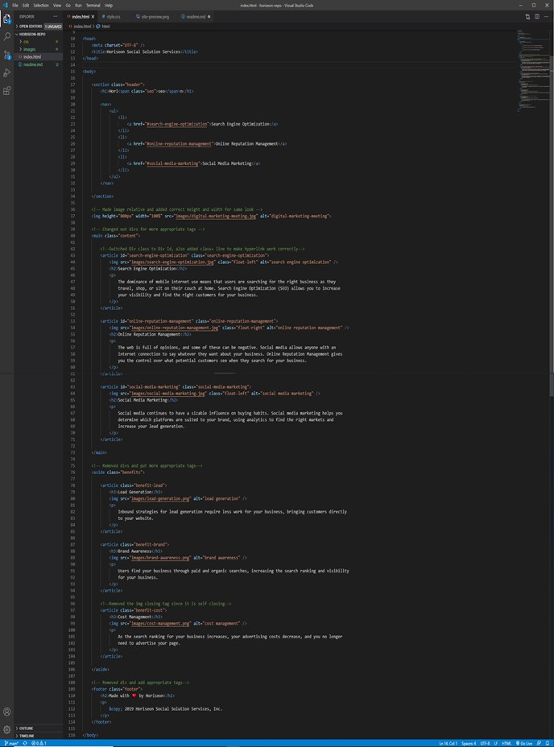
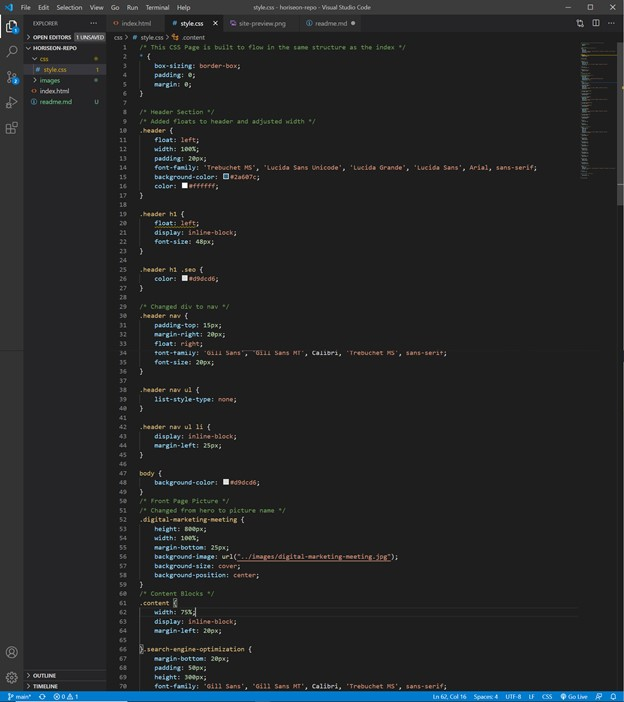

<header>
    <h1>Code Refractor Assignment</h1>
</header>

<body>

<h2>Purpose:</h2>
    

 The purpose of this activity is to add accessibility to Horiseon's website. While also fixing any errors in the code that we may have run across. Lastly, organizing the html and css to make them eaiser to follow. 

<h2>Task List:</h2>

<ol>
    <li> Provide a webpage that meets accessibility standards. </li>
    <li> Make changes to the HTML code to add semantics. </li>
    <li> Create and follow a logical HTML code structure. </li>
    <li> All images provide alt attributes. </li>
    <li> All heading are in sequential order. </li>
    <li> Provided a descriptive title. </li>
</ol>

<h2>Website Deployment</h2>

 The current version of this website can be found here. <a href="https://bhamm90.github.io/horiseon-repo/">(Horiseon)</a>

<h2>Feedback</h2>

 Please get ahold of us with any suggestions for features/items you believe should be added. Also feel free to let us know of any issues you may come across while using the page. You can reach me on <a href="https://stackoverflow.com/users/14324130/bhamm90">Stack Overflow</a> with any comments and concerns. For any issues and fixes you can file an issue at the <a href="https://github.com/BHamm90/horiseon-repo">Horiseon Repository</a> so we can fix them as soon as possible. 

<h3>Website Preview:</h3>

<h3>Preview of the HTML / CSS: <h3>

 

<h4>Looking Forward: <h4>

 We would like to continue on in increasing our ability to make our webpage more accessible for all. Hopefully with feedback from the community we can provide changes you would like to see as well. Thank you for all your support and feedback in advance. 

<Footer>
 
 © 2020 Trilogy Education Services, a 2U, Inc. brand. All Rights Reserved. 
